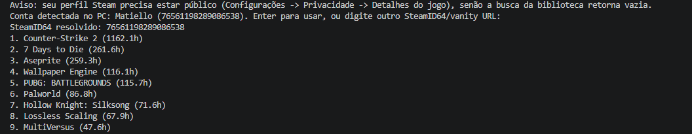
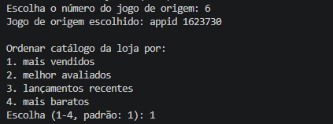
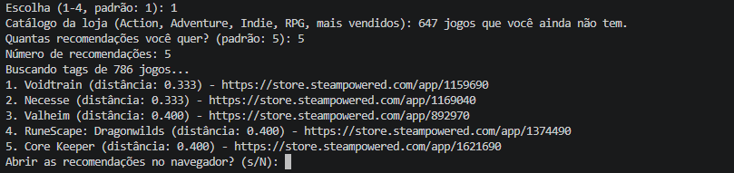

# Recomendador de Jogos da Steam

**Número da Lista**: 2<br>
**Conteúdo da Disciplina**: Grafos 2<br>

## Alunos

|Matrícula | Aluno |
| -- | -- |
| 21/1062179  |  Marcelo de Araújo Lopes |
| 17/0020339  |  Paulo Lucca |

## Sobre

O projeto recomenda jogos da Steam que o usuário **ainda não possui**, a partir
de um jogo da própria biblioteca que ele escolhe como ponto de partida.

O problema é modelado como um **grafo ponderado**:

- **Nós**: os jogos da biblioteca do usuário mais um catálogo de até 1000 jogos
  da loja Steam, filtrado pelos gêneros do jogo de origem.
- **Arestas**: existe aresta entre dois jogos quando a **similaridade de
  Jaccard** entre os conjuntos de tags deles passa de `0.1`.
- **Peso**: `1 - jaccard`. Jogos parecidos ficam com peso baixo, que é
  justamente o que o Dijkstra minimiza.

O limiar de `0.1` é o que mantém o grafo esparso: sem ele quase todo par de
jogos teria aresta, já que dois jogos quaisquer costumam compartilhar alguma
tag, e o caminho perderia o sentido.

Sobre esse grafo roda o **algoritmo de Dijkstra** com fila de prioridade
(`heapq`), a partir do jogo escolhido. O resultado é a distância mínima
acumulada até cada jogo alcançável; a lista é ordenada por essa distância e os
jogos que o usuário já possui são descartados da resposta. Por isso o caminho
pode atravessar jogos da biblioteca, mas o destino recomendado é sempre um jogo
novo — é o que dá sentido a usar caminho mínimo em vez de só olhar o vizinho
mais parecido.

Os pesos são não-negativos por construção (o Jaccard fica em `[0, 1]`, logo
`1 - jaccard` também), que é o pré-requisito do Dijkstra. Nós inalcançáveis,
resultado de o limiar deixar o grafo desconexo, simplesmente não aparecem no
dicionário de distâncias.

Exemplos de saída real:

| Jogo de origem | Recomendações |
| -- | -- |
| Counter-Strike 2 | Rainbow Six Siege, Arma 3, Call of Duty, Squad |
| The Witcher 3 | The Witcher 1, The Witcher 2, Oblivion, Gothic |
| Palworld | Voidtrain, Necesse, Valheim, Core Keeper |

## Vídeo de apresentação

[Apresentação do projeto](assets/apresentacao.mp4) — 4min54, com demonstração do
programa em execução e explicação do grafo, da similaridade de Jaccard e do
Dijkstra.

## Screenshots


*Detecção da conta local e biblioteca listada por horas jogadas.*


*Escolha do jogo de origem — o nó de partida do Dijkstra — e de como ordenar o
catálogo da loja.*


*Saída do Dijkstra: partindo de Palworld, 785 nós no grafo e as recomendações
ordenadas por distância, com link da loja.*

## Instalação

**Linguagem**: Python 3.11+<br>
**Framework**: nenhum (apenas `requests` e `python-dotenv`)<br>

Pré-requisitos:

- Python 3.11 ou superior.
- Uma chave da Web API da Steam, gerada em https://steamcommunity.com/dev/apikey
- Perfil da Steam **público** em *Configurações → Privacidade → Detalhes do
  jogo*. Com o perfil privado a API devolve a biblioteca vazia.

Comandos:

```bash
git clone https://github.com/projeto-de-algoritmos-2026/Grafos2_Recomendador-de-Jogos-Steam
cd Grafos2_Recomendador-de-Jogos-Steam

python -m venv venv
venv\Scripts\activate        # Windows
source venv/bin/activate     # Linux / macOS

pip install -r requirements.txt

cp .env.example .env         # preencha STEAM_API_KEY
python src/main.py
```

Para rodar os testes:

```bash
python -m unittest discover tests
```

## Uso

O programa é interativo e conduz por quatro passos:

1. **Perfil.** Se o cliente Steam estiver instalado, a conta logada é detectada
   automaticamente — basta apertar Enter. Também é possível digitar um
   SteamID64 (17 dígitos) ou uma vanity URL (`steamcommunity.com/id/nome`).
2. **Jogo de origem.** A biblioteca é listada por horas jogadas; escolha o
   número do jogo que servirá de nó de partida.
3. **Catálogo e quantidade.** Escolha como ordenar o catálogo da loja (mais
   vendidos, melhor avaliados, lançamentos recentes ou mais baratos) e quantas
   recomendações quer receber.
4. **Resultado.** As recomendações aparecem com nome, distância e link da loja,
   e o programa pergunta se deve abrir os links no navegador.

A primeira execução é mais lenta porque busca as tags dos jogos na Steam; as
seguintes usam o cache local e montam o grafo em segundos.

## Outros

### Estrutura

| Arquivo | Responsabilidade |
| -- | -- |
| `src/similarity.py` | Similaridade de Jaccard entre conjuntos de tags. |
| `src/graph.py` | Construção do grafo ponderado e algoritmo de Dijkstra. |
| `src/steam_client.py` | Integração com a Steam: perfil, biblioteca, catálogo e tags. |
| `src/cache.py` | Cache local das tags em `data/cache.json`. |
| `src/main.py` | Interface de terminal e orquestração do fluxo. |
| `tests/test_similarity.py` | Testes do Jaccard. |

### Complexidade

A construção do grafo compara todos os pares de jogos: O(V²) cálculos de
Jaccard. O Dijkstra com fila de prioridade é O((V + E) log V). Na prática o
grafo tem entre ~770 e ~1120 nós, dependendo dos gêneros do jogo de origem.

### Decisões de implementação

- **Catálogo externo limitado por gênero e vendas.** Buscar os ~200k apps da
  loja é inviável, então o pool para em 1000 jogos, vindos da busca da loja
  filtrada pelos gêneros do jogo de origem. A ordenação é escolhida no menu; o
  padrão é mais vendidos, porque ordenar por avaliação enche o pool de indie
  nichado de nota alta, que não serve como recomendação.
- **As tags vêm de `IStoreBrowseService/GetItems`, não de `appdetails`.** São
  as tags de usuário (`FPS`, `Souls-like`, `Co-op`), que descrevem o jogo bem
  melhor que os `genres`/`categories` do `appdetails` — lá, recurso de
  plataforma se mistura com gênero, e o CS2 casava com um jogo casual de
  culinária por ambos terem `Stereo Sound` e `Camera Comfort`. O ganho também é
  de tempo: o `appdetails` aceita 1 appid por chamada e corta em ~200
  chamadas/5min (~10min para ~900 jogos), enquanto este aceita 200 appids por
  chamada — o mesmo grafo sai em ~10s.
- **Cache local.** O resultado de cada consulta fica em `data/cache.json`, com
  validade de 30 dias, gravado de forma atômica (arquivo temporário +
  `os.replace`) para uma interrupção no meio da escrita não corromper o cache.
